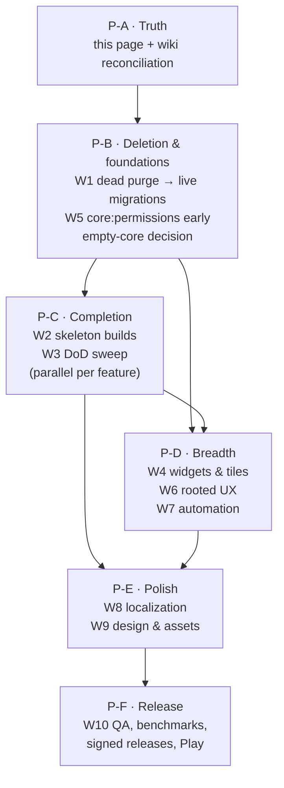

# Completion Master Plan

> The gap analysis and phased roadmap that takes HardwareDash from
> "Phase 2 feature-complete" to a **finished, high-end, fully consistent,
> fully localized app** — every module done to the
> [Module Authoring Contract](Module-Authoring-Contract), customizable
> widgets everywhere, centralized permission management, complete root
> flavors, a high-end automation engine, deep user customization, and a
> release-grade quality bar.
>
> All numbers on this page were **measured against the tree on
> 2026-07-03** (`main` @ `29b2bc3`), not copied from other wiki pages —
> several catalog pages had drifted (see
> [Roadmap & Status](Roadmap-and-Status)); they were reconciled in the
> same change that added this page.

---

## 1. Where the app actually stands

### 1.1 The migration scorecard

- **Navigation is fully modular.** Every route in `MainActivity`'s nav
  graph targets a `dev.ranzlappen.gadget.feature.*` screen. No legacy
  screen is user-reachable.
- **Legacy `com.gadget.*` is extinct (W1 ✅).** As first audited there
  were 96 files across `:app` source sets; they have all been deleted,
  migrated into feature/core modules, or repackaged under
  `dev.ranzlappen.gadget.*`, and `:app` now compiles with
  `namespace = "dev.ranzlappen.gadget"`. Only `:lsposed-module` (still
  `com.gadget.spoofer.xposed`) remains, out of scope. The rest of §1
  describes the state that motivated the plan.
- **Only `:feature:torch` and `:feature:vibration` meet the full
  definition of done** (screen + design system + MetricSource +
  ActionHandler + widgets + tile [torch] + rooted sibling + tests +
  strings). They are the blueprint; everything else is at some earlier
  stage of copying it.

### 1.2 Feature-module completeness matrix (measured)

Src = `*.kt` under `src/main` · Tests = `*.kt` under `src/test` +
`src/androidTest` · MS = `MetricSource` bound `@IntoMap` ·
AH = `ActionHandler` bound `@IntoMap` · W/T = home-screen widgets /
QS tiles · Str = base `strings.xml` entries.

| Module | Src | Tests | UI screen | MS | AH | W/T | Str | Verdict |
|---|---:|---:|:--:|:--:|:--:|:--:|---:|---|
| `torch` (+`-rooted` 7, `-standard` 3) | 46 | 9 | ✅ | ✅ | ✅ | 4 W + 2 T | 120 | **Done** — the blueprint |
| `vibration` (+`-rooted` 5, `-standard` 2) | 43 | 8 | ✅ | ✅ | ✅ | 4 W | 124 | **Done** — no tile |
| `apps` (+`-rooted` **0**) | 38 | 4 | ✅ | ✅ | ✅ | 1 W | 74 | `folder_count` MS; refresh/open-folder/launch-app AH; rooted sibling **empty**; no `MonitorContainer` in screen yet |
| `gps` (+`-rooted` 5) | 29 | 4 | ✅ | ✅ | ✅ | — | 39 | track/spoof + rooted NMEA/constellation/reset AH; widget still missing |
| `flipper` (+`-rooted` 3) | 21 | 3 | ✅ | ✅×2 | ✅ | — | 28 | Missing widget/tile |
| `youtubedownloader` | 17 | 1 | ✅ | ✅ | ✅ | — | 65 | Missing progress widget |
| `battery` (+`-rooted` 9) | 17 | 1 | ✅ | ✅ | ✅ (rooted only) | 1 W | 57 | AH wraps rooted `BatteryController`; no standard-tier assert (read-only telemetry) |
| `storage` (+`-rooted` 6) | 16 | 1 | ✅ | ✅ | ✅ (rooted only) | 1 W | 27 | Standard-tier AH missing |
| `radios-ir` (+`-rooted` 3) | 16 | 0 | ✅ | exempt* | ✅ | — | 38 | No tests |
| `radios-nfc` (+`-rooted` 2) | 16 | 0 | ✅ | ✅ | ✅ | — | 32 | No tests |
| `radios-bt` (+`-rooted` 3) | 15 | 0 | ✅ | ✅ | ✅ | — | 29 | No tests, no widget |
| `radios-wifi` (+`-rooted` 6) | 13 | 0 | ✅ | ✅×2 | ✅ | — | 40 | Signal widget in flight |
| `audio` (+`-rooted` 5) | 13 | 0 | ✅ | ✅ | ✅ | — | 30 | No tests |
| `camera` (+`-rooted` 6) | 13 | 0 | ✅ | exempt* | ✅ | — | 37 | AH covers rooted capture rows + scan-history clear; no test dir yet |
| `diagnostics` (+`-rooted` 6) | 11 | 1 | ✅ | ✅ | ✅ | — | 14 | Memory widget candidate |
| `radios-subghz` | 9 | 2 | ✅ | ✅ | ✅ | — | 26 | SDR data path = rooted follow-up |
| `ambient` | 8 | 0 | ✅ | ✅ | ✅ | — | 24 | Lux widget in flight |
| `lock` (+`-rooted` 4) | 8 | 0 | ✅ | ✅ | ✅ | — | 22 | Tile candidate |
| `settings` | 7 | 0 | ✅ | n/a | n/a | — | — | No language picker; strings hardcoded |
| `automation-ui` | 6 | 1 | ✅ | n/a | n/a | — | 95 | Rule editor live |
| `motion` | 7 | 0 | ✅ | ✅ | ✅ | — | 29 | assert-motion/steps/rotation actions |
| `sensors` | 6 | 2 | ✅ | ✅ | ✅ | — | 23 | assert-near/far, assert-bright/dark, assert-above/below |
| `bugreport` (+`-rooted` 3) | 6 | 1 | ✅ | ✅ | ✅ | — | 26 | `bugreport_permission_readiness` MS (granted %) |
| `actuators` | 6 | 0 | ✅ | ✅ | ✅ | — | 21 | `vibrator_available` MS (presence, not a modelled pulse) |
| **`display`** (+`-rooted` 5) | 4 | 0 | ❌ | ❌ | ❌ | — | 0 | **Controller-only skeleton** |
| **`microphone`** (+`-rooted` 5) | 4 | 0 | ❌ | ❌ | ❌ | — | 0 | **Controller-only** (dB/record UI lives in `audio`) |
| **`notification`** (+`-rooted` 4) | 4 | 0 | ❌ | ❌ | ❌ | — | 0 | **Controller-only skeleton** |
| **`adbdebug`** (+`-rooted` 5) | 4 | 0 | ❌ | ❌ | ❌ | — | 0 | **Controller-only skeleton** |
| **`usbdebug`** (+`-rooted` 5) | 4 | 0 | ❌ | ❌ | ❌ | — | 0 | **Controller-only skeleton** |
| **`automation`** (+`-rooted` 4) | 4 | 0 | ❌ | ❌ | ❌ | — | 0 | **Controller-only** — confusing twin of `automation-ui` |
| **`radios-cell`** (+`-rooted` 2) | 3 | 0 | ❌ | ❌ | ❌ | — | 0 | Screenless by design so far; standard tier unbuilt |
| `manual` | 2 | 0 | ✅ (thin) | n/a | n/a | — | 17 | Static; no per-module deep links |
| `dashboard` | 2 | 0 | ✅ (thin) | n/a | n/a | — | 0 | No user customization (reorder/hide) |
| **`apps-rooted`** | 0 | 0 | — | — | — | — | — | **Empty (`.gitkeep`)** |

\* `camera` and `radios-ir` are discrete-event modules — exempt from the
monitoring-container requirement per the
[Module Authoring Contract](Module-Authoring-Contract); the exemption
should be recorded inline in each module.

**Cross-cutting coverage (measured after the W3 consistency sweep):**
MetricSource in **20** feature families (was 17 — `apps`/`bugreport`/
`actuators` added); ActionHandler in **22** feature families (was 15+6 —
`gps`/`motion`/`sensors`/`camera`/`battery`/`apps` added, the last two
rooted-tier only); widgets in **5** features (torch ×4, vibration ×4,
battery, storage, apps); QS tiles in **1** (torch ×2); **8** `@Preview`
composables in the whole tree; **1,002+** base string entries across 24
feature modules with **zero** translations (only `:app` has
`values-de/es/fr`, each 24 of 42 entries ≈ 57 %, and stale). Remaining
gap against the matrix in §1.2: `gps`/`storage`/`camera`/`apps` still
lack widget coverage, and `display`/`microphone`/`notification`/
`adbdebug`/`usbdebug`/`automation`/`radios-cell` remain controller-only
skeletons (W2, unstarted).

### 1.3 Core-module status (measured)

| Core module | Src / Tests | State |
|---|---|---|
| `core:widgetkit` | 33 / 2 | Substantial — full RemoteViews framework, appearance/size/icon customization, pin flow, boot re-arm |
| `core:root` | 26 / 0 | Substantial — safety gate, capability registry, soft limiter, mutation log, `AlsaMixerControl` |
| `core:ui` | 23 / 12 | Substantial — component library |
| `core:automation` | 22 / 8 | Substantial — full trigger/condition/action engine, best-tested subsystem |
| `core:data` | 20 / 2 | Substantial — modular Room DBs + integration test |
| `core:monitoring` | 19 / 2 | Substantial — MonitorService, charts, notifier |
| `core:designsystem` | 9 / 1 | Good — tokens, themes, a11y locals |
| `core:datastore` | 5 / 2 | Adequate |
| `core:navigation` | 4 / 0 | Adequate |
| `core:hardware` | 2 / 1 | Adequate |
| `core:notifications` | 2 / 0 | Thin |
| `core:testing` | 2 / 0 | Thin — needs fixtures for the test push |
| `core:model` | 1 / 0 | Deliberately tiny (`MetricSource` seam) |
| **`core:permissions`** | **0** | **Empty** — permission logic is ad-hoc per feature |
| **`core:surfaces`** | **0** | **Empty, unreferenced** |
| **`core:domain`** | **0** | **Empty** |
| **`core:common`** | **0** | **Empty** |

### 1.4 Legacy inventory — `com.gadget.**` (96 files)

**Dead (unreachable at runtime, delete first):**

| Area | Files | Why dead |
|---|---|---|
| `com/gadget/widget/**` (10 providers + `WidgetConfigActivity` + `WidgetActionHandler` + `WidgetMetrics` + `DrawnPatternUtils`) + `res/layout/widget_{action,layout}.xml` | 13 + 2 XML | No provider is manifest-registered; `MainActivity` even cancels their orphaned periodic work |
| Shadow services: `GadgetService`, `LinkService`, `VibrationService`, `StrobeService`, `VideoRecordService`, `VoiceRecordService`, `DbMeterService`, `NfcEmulationService` | 8 | **Still declared in `app/src/main/AndroidManifest.xml`** but only referenced by the dead widgets / orphaned screens; modular twins exist (torch strobe, NFC HCE, audio record) |
| `ui/link/**` (`LinkScreen`, `LinkModels`, `MetricMetadata`) | 3 | Not in the nav graph — superseded by `:core:monitoring` |
| `ui/logbook/LogbookScreen` (+ view model) | ~2 of 5 | Screen not in the nav graph; `LogbookReminderWorker` channel is still init'd at boot |

**Live (must be migrated, not deleted):**

| Area | Files | Migration target |
|---|---|---|
| `localization/` — hand-rolled `Strings.kt` i18n table (~900 lines), init'd at boot | 4 | Per-module `strings.xml` (W8) |
| `ui/theme/` — `ThemePreferencesManager` + `AccessibilityPreferencesManager` (boot-init) + legacy `GadgetTheme` splash wrap | 8 | `:core:datastore` / `:core:designsystem` |
| `data/db|worker|preferences|repository` — Room `GadgetDatabase`, `MetricDao`, workers, `MetricRepository` | 8 | `:core:data` (already promised in `app/build.gradle.kts`) |
| `backup/` — `BackupManager` + `BackupCard` (settings `backupSection` slot) | 3 | `:core:data` backup v6 + `:feature:settings` |
| `keepalive/` + `services/PersistentKeepAliveService` (+ flavor controllers) | 3 + 1 + 4 | New `:feature:keepalive` (+`-rooted`) — **the blocker for the last un-migrated rooted controller** |
| `root/` — `RootFeaturesEntryPoint`, `FatalLaunchScreen`, `RootedFeatureTogglesCard` | 3 | `:core:root` UI + settings slot |
| `permissions/` — onboarding coordinator remnants | 4 | New `:core:permissions` (W5) |
| `notifications/` — channels, `BuilderPresetStore`, `NotificationPreviewCard` | 4 | `:core:notifications` / `:feature:notification` (W2) |
| `receivers/` — `AdminReceiver`, `ScheduleActionReceiver` | 2 | Owning modules / app shell |
| `CallerScreenActivity`, `MainActivity`, `GadgetApplication`, `di/` | 5 | `dev.ranzlappen.gadget.app` (endgame) |
| `ui/components/**` — legacy component twins | 12 | Delete once the orphans above go (they are the only consumers) |
| `ui/logbook` data layer | ~3 | Rebuild as `:feature:logbook` (W2) or archive |

**Also:** `:lsposed-module` → repackage to
`dev.ranzlappen.gadget.spoofer.xposed`; `:benchmark` is an empty shell
awaiting Phase 4.

### 1.5 Documented-vs-real drift (fixed alongside this page)

- `Home.md` claimed ~297 legacy files, `Module-Catalog.md` ~284 — the
  measured number is **96** (the Roadmap had it right).
- `Module-Catalog.md` / `Feature-Catalog.md` still showed `radios-wifi`,
  `ambient`, `actuators`, `diagnostics(+rooted)`, `storage-rooted`,
  `manual` as 0-source skeletons and omitted `radios-cell`,
  `display`, `microphone`, `notification`, `adbdebug`, `usbdebug`,
  `automation` (controllers), and the `gps/motion/audio/camera/…` "planned"
  table — all are real now.
- Torch #95 (brightness slider) and #101 (overlay) were listed as both
  open and done — they are **done** (`claude/open-issues-xktnze`).

---

## 2. The workstreams

Ordering principle: **truth → deletion → foundations → per-feature
completion → cross-cutting breadth → polish → release.**
Effort: **S** ≈ 1 PR · **M** ≈ 2–4 PRs · **L** ≈ epic (5+ PRs).
Every PR keeps the standing invariants: new code under
`dev.ranzlappen.gadget.**`, no `com.gadget` imports, root only via the
`:core:root` seam, no feature-to-feature dependencies, design-system
components only, monitoring- **and** automation-ready before "done",
wiki updated in the same PR.

### W1 — Legacy extinction (finish Phase 2) · **L** · ✅ DONE

> **Completed.** `find app/src -path "*com/gadget*" -name "*.kt"` returns
> **0** and the `:app` namespace is now `dev.ranzlappen.gadget`. The wave:
> dead-island purge → delete legacy Room `GadgetDatabase` (backup reworked
> to format v6 on raw files) → delete legacy theme stack → split keep-alive
> into `:feature:keepalive` (+`-rooted`), the last legacy rooted controller
> → repackage the app shell + flip the namespace (R / BuildConfig /
> ProGuard follow). Only the out-of-scope `:lsposed-module`
> (`com.gadget.spoofer.xposed`) remains, interlocked with the GPS-spoofer
> handshake and tracked separately. Original plan for the record:

1. **Dead-code purge (S):** delete `com/gadget/widget/**` + the two
   widget XML layouts, the 8 shadow-service manifest entries **and**
   their classes, `ui/link/**`, the orphaned `LogbookScreen`, and every
   `ui/components/**` file that becomes unreferenced. Acceptance: no
   manifest entry points at a dead class; standard + rooted CI green.
2. **Migrate live subsystems — one PR each, in dependency order:**
   1. `data/db` Room + `MetricRepository` + workers → `:core:data`.
   2. `backup/` → `:core:data` (backup **v6**: modular DBs + widget
      configs + automation rules + DataStore, export→re-import verified
      on a fresh install); `BackupCard` → `:feature:settings`.
   3. `ui/theme` preference managers → `:core:datastore` +
      `:core:designsystem`; retire the legacy splash `GadgetTheme`.
   4. `keepalive/` + `PersistentKeepAliveService` → new
      `:feature:keepalive` (+`-rooted`), unblocking the **last
      un-migrated rooted controller**; surface it in Settings /
      Diagnostics.
   5. `root/` UI (`FatalLaunchScreen`, `RootedFeatureTogglesCard`) →
      `:core:root` + settings slot; dissolve `RootFeaturesEntryPoint`.
   6. `permissions/` remnants → `:core:permissions` (W5),
      `notifications/` remnants → `:core:notifications` /
      `:feature:notification` (W2), `localization/` → resources (W8).
   7. `receivers/`, `CallerScreenActivity` (→ owning feature),
      `MainActivity`, `GadgetApplication`, `di/` →
      `dev.ranzlappen.gadget.app`.
3. **Endgame (S):** flip `:app` `namespace` to `dev.ranzlappen.gadget`,
   drop the `com.gadget` import-gate exemptions, repackage
   `:lsposed-module`.
   **Exit criterion:** `find app/src -path "*com/gadget*" -name "*.kt" | wc -l` → **0**.

### W2 — Finish the skeleton features · **L**

Full [Module Authoring Contract](Module-Authoring-Contract) builds
(`ModuleScreenScaffold` + `ModuleInfo` + tri-state capabilities screen,
MetricSource, ActionHandler, nav route + dashboard tile, strings,
previews, tests), using torch/vibration as the blueprint:

- **`display`** — brightness / refresh rate / rotation / resolution
  readouts, `screen_brightness` MetricSource, assert/set actions
  (`WRITE_SETTINGS` flow from W5); rooted density / refresh / extreme
  rows via the existing `display-rooted` controllers.
- **`microphone`** — input-device inventory, gain, live level (reuse the
  `AudioRecorder` seam from `:feature:audio` via a `core` promotion, not
  a feature-to-feature import); rooted gain / direct-PCM rows exist.
- **`notification`** — channel inspector + notification builder /
  presets (absorbs legacy `BuilderPresetStore` + `NotificationPreviewCard`),
  post/cancel/assert actions, notification-listener opt-in for a
  `active_notifications` MetricSource.
- **`adbdebug` / `usbdebug`** — debug-state readouts + Settings
  deep-links on standard, toggle via the existing rooted controllers,
  `adb_enabled` / `usb_debugging` MetricSources (they make strong
  automation triggers).
- **`radios-cell`** — standard `TelephonyManager` screen (SIM / network
  type / signal), `cell_signal` MetricSource; the rooted Qualcomm dump
  stays a capability-row surface.
- **`apps-rooted`** — pm-based freeze / disable / force-stop behind
  `RootFeatureKey`s, surfaced as rooted rows + `apps_root` ActionHandler.
- **`feature:automation` (controllers)** — fold into `:core:automation`
  or make it the engine's own module surface (engine on/off tile +
  status screen); remove the confusing empty twin of `automation-ui`.
- **`:feature:logbook`** — rebuild the legacy logbook (session notes +
  reminders) as a modular feature; **`:feature:keepalive`** — from W1.

### W3 — Consistency sweep to the definition of done · **M** (✅ done, 2026-07-09)

Closed the ActionHandler/MetricSource half of the matrix in §1.2 for the
already-built modules — each handler/source reuses the module's existing
controller/state rather than inventing new hardware logic, per the
torch/vibration reference pattern:

- **ActionHandlers added:** `gps` (track start/stop, spoof start/stop,
  rooted NMEA-tap / constellation-dump / reset-mutations); `motion`
  (assert-motion-detected / assert-motion-idle / assert-steps-above /
  assert-rotation-above, mirroring `ambient`'s assert pattern); `sensors`
  (proximity assert-near/far, light assert-bright/dark, acceleration
  assert-above/below — each fails rather than trusting the `0f`
  absent-value when the sensor isn't present); `camera` (rooted
  high-fps/manual-override/raw/multi-camera/HAL-bypass/shutter-sound
  capture rows + standard-tier scan-history clear; no baseline
  photo-capture or torch-toggle action exists to wrap — neither has a
  headless/FGS path); `battery` (rooted `BatteryController` wrap —
  charging-profile override / thermal bypass / charging-type override /
  full dump / reset overrides / hold-SoC / wireless coil-current cap /
  health snapshot; no standard-tier assert since baseline telemetry is
  read-only `BatteryManager` reads with no controller state); `apps`
  (refresh-apps, open-folder, launch-app by `appKey`).
- **MetricSources added:** `apps` (`apps_folder_count`, pushed from the
  same `AppsDao.observeFolders()` flow `FolderWidgetController` already
  watches); `bugreport` (`bugreport_permission_readiness`, the granted/
  total diagnostic-permission percent the screen already surfaces as a
  warning chip); `actuators` (`vibrator_available`, a static
  `Vibrator.hasVibrator()` presence check — the haptic actions are
  fire-and-forget one-shots with no "currently vibrating at X" state
  worth modelling).
- **Still open (out of this sweep's scope):** `storage` standard-tier
  ActionHandler (assert-free-space); widget coverage for `gps`/`camera`/
  `apps`-beyond-its-existing-folder-widget; embedding `MonitorContainer`/
  `LiveMonitorContainer` in the `apps` screen (the MetricSource exists,
  the screen wiring doesn't yet).
- Every screen embeds `MonitorContainer` + `LiveMonitorContainer` where
  signals exist; tri-state capability rows cover all rooted functions;
  `ModuleInfo` blocks complete; all entry points converge on the same
  `@Singleton` controller.
- One PR per feature family; CI green on both flavors each time.

### W4 — Widgets & tiles everywhere, fully customizable · **L**

- **Generic metric widget (the multiplier):** generalize the
  torch/vibration `MonitorWidgetProvider` / `MonitorChartWidgetProvider`
  pair into `:core:widgetkit`-level gauge + chart widgets with a
  **configurable metric picker** — one implementation instantly gives
  every monitored signal (17 families today) a home-screen widget.
- **Per-feature function widgets** where a clean action exists: GPS
  coordinates, audio dB / record, lock, WiFi/BT state (where the OS
  allows), Flipper status, download progress, **automation run-rule**.
- **QS tiles** for every clean toggle: vibration, lock, keepalive,
  automation engine on/off (torch's two tiles are the pattern —
  `TileService` → same `@Singleton` controller via `EntryPointAccessors`).
- **Customization polish:** `WidgetCustomizationSheet` (appearance /
  size presets / custom-icon import) uniformly on every provider; widget
  gallery `previewImage`s; pin-reliability contract (both halves)
  everywhere. **Stay on RemoteViews** — no Glance (consistent with
  `:core:widgetkit`'s design).

### W5 — Permission management · **M**

Build `:core:permissions` for real (empty today):

- Per-feature **permission registry** (`@IntoMap` contributions of
  required/optional runtime + special permissions per feature).
- Grant-state observer + request orchestration — promote the working
  `:feature:bugreport` permission-manager UI into core.
- **Special-permission steps:** overlay, exact alarm, notification
  listener/post, `WRITE_SETTINGS`, all-files — each with rationale UI +
  Settings deep-link.
- Rooted one-tap `pm grant` (exists in `bugreport-rooted`) wired as the
  privileged path.
- A **Permissions dashboard** in Settings + per-module `ModuleInfo`
  integration; **first-run onboarding** flow (replaces the deleted
  legacy coordinator).

### W6 — Root flavor completion · **M**

- **Re-surface rooted UX natively in every feature screen** (the #94
  Phase-3 epic): the migrated controllers are wired but dormant — add
  interactive rooted sections per screen behind `RootSafetyGate`
  (never `BuildConfig.IS_ROOTED`).
- Finish `apps-rooted` and `keepalive-rooted` (W1/W2); build the
  Sub-GHz **SDR data path** (rooted follow-up).
- Repackage `:lsposed-module`; stand up **signed `rooted-release.apk`**
  in CI (currently debug-only).
- Root-safety audit: every rooted capability has a `RootFeatureKey`,
  soft-limiter coverage, and mutation logging; leak gates stay green.

### W7 — High-end automation · **M**

- **Nested condition groups** — the deferred `Group` node (the sealed
  `Condition` shape already leaves room).
- **Rule templates & sharing:** prebuilt recipes, JSON export/import
  (rides backup v6), deep-link/QR import.
- **Dry-run / test-fire** mode + a **firing-history log** UI in
  `automation-ui`; per-rule cooldown controls (the engine's
  `AutomationBudget` already exists).
- New triggers: time-window, hysteresis presets.
- **FGS consolidation:** one shared service for monitoring + automation
  (resolves ADR-0002's flagged double-notification consequence).
- **External hook:** exported, opt-in broadcast/intent API for firing
  rules (Tasker-style interop).

### W8 — Full localization (de, es, fr) · **M**

- Externalize the legacy `Strings.kt` table (~900 lines) into module
  `strings.xml` (joint with W1).
- Translate **all** module strings (1,000+ entries today and growing)
  to **de, es, fr**; refresh the stale `:app` translations.
- **Per-app language picker** in Settings (`localeConfig` +
  AndroidX per-app locales).
- Enforcement: lint `MissingTranslation` / hardcoded-string checks once
  lint stops being `continue-on-error` (W10); pseudo-locale (`en-XA`)
  render in the preview gallery; RTL smoke check.

### W9 — Design, customization & assets · **L**

- **Design-consistency pass** over every screen against
  [Design System](Design-System) (tokens only, no raw `dp`, a11y
  contract: contrast, 48 dp targets, TalkBack labels) — checklist-driven,
  one PR per screen cluster.
- **Quality assets:** per-module adaptive icons (7 drawables exist
  today), widget preview images, empty-state illustrations, themed app
  icon; catalogue everything in [Asset Catalog](Asset-Catalog).
- **User customization:** dashboard editor (reorder / hide / pin
  modules), custom palette builder on top of the preset themes,
  dynamic-color (Monet) opt-in, per-feature settings pages under a
  unified settings tree.
- **Preview coverage:** full `@Preview` matrix per component/screen (8
  exist today); extend foldable/tablet adaptive layouts beyond dashboard
  + scaffold.
- **Motion & interaction polish:** predictive back, shared-element /
  motion transitions, edge-to-edge audit, haptic feedback consistency.

### W10 — Quality, testing, CI & release · **M**

- Fill the test gap: ~20 modules have zero tests — unit tests on
  `:core:testing` fixtures (grow the fixtures first), per-feature
  instrumented tests, emulator CI matrix.
- `:benchmark` macrobenchmarks + **baseline profiles** (startup, scroll).
- Remove lint `continue-on-error`; keep the import/leak gates.
- **Release engineering:** signed standard **and rooted** release
  pipeline, Play metadata + data-safety form, staged-rollout checklist
  (versioning scheme already in place).
- **Privacy-first crash handling:** local crash/ANR capture surfaced in
  `:feature:bugreport` — no third-party telemetry.
- In-app **changelog / "What's new"** + per-feature
  [Manual](Feature-Catalog) deep-links; **global search / command
  palette** over modules & actions; static + dynamic **app shortcuts**;
  rebuilt **data export** (CSV of metric history — the legacy exporter
  was deleted as dead code; rebuild on `:core:data` + monitoring UI).

**Deliberately out of scope:** Wear OS companion, cloud sync (no
backend), a Glance rewrite (contradicts `:core:widgetkit`'s
RemoteViews-by-design).

---

## 3. Phase ordering & dependencies

1. **P-A (truth):** this page + catalog reconciliation. ✅ (this change)
2. **P-B (deletion & foundations):** W1 dead-purge, then the live
   migrations; start W5 (`:core:permissions`) early — it unblocks the W2
   screens. Decide the empty core modules: **keep `core:permissions`**
   (W5 fills it); **drop `core:surfaces` / `core:domain` /
   `core:common` from the module graph** until a concrete need exists
   (an empty module wired into settings.gradle is pure upkeep — easy to
   re-add).
3. **P-C (completion):** W2 + W3, parallelizable per feature family.
4. **P-D (breadth):** W4 + W6 + W7.
5. **P-E (polish):** W8 + W9 (localize **after** the string surface
   stabilizes, not before).
6. **P-F (release):** W10, signed rooted release, Play submission.

### Definition of "the app is complete"

- 0 legacy `com.gadget` files; `:app` namespace flipped; LSPosed module
  repackaged.
- Every feature family: screen ✅ · MetricSource ✅ (or recorded
  exemption) · ActionHandler ✅ · widget and/or tile where sensible ✅ ·
  rooted rows surfaced interactively ✅ · tests ✅ · previews ✅ ·
  strings in 4 languages ✅.
- `:core:permissions` live with dashboard + onboarding; backup v6
  round-trips everything; automation has groups/templates/history; one
  FGS notification; lint hard-fails; benchmarks + baseline profiles in
  CI; signed standard **and** rooted releases produced on tag.

---

> _Last reviewed: 2026-07-09 · Source: measured tree audit @ `29b2bc3`
> (`find`/`grep` counts over `app/`, `core/`, `feature/`,
> `settings.gradle.kts`, `app/src/main/AndroidManifest.xml`) · Related
> modules: all._
